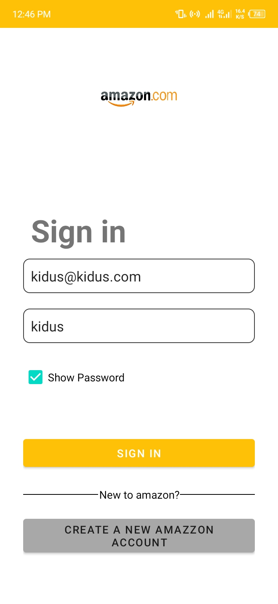
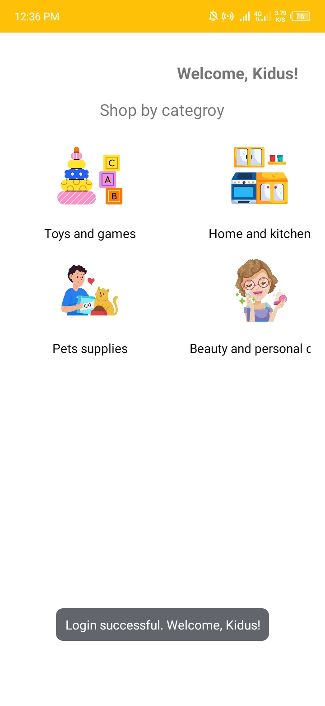
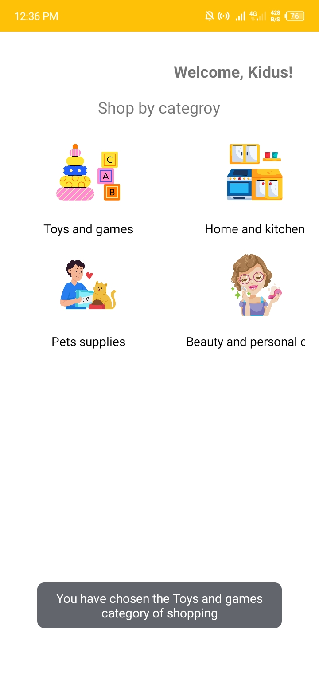
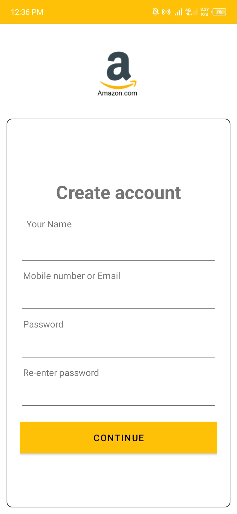
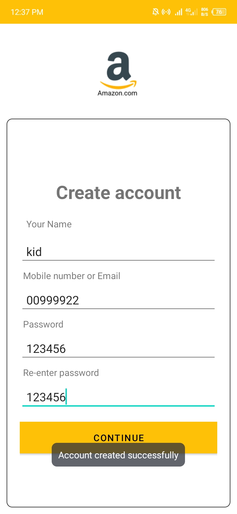

 
  
  &#xa0;

<h1 align="center">Ecommerce App</h1>

<h1> Screenshoots </h1>

 

  

  

  

  

<!-- 

 --> -->

programming language

- [Kotlin](https://kotlin.com/)

&#xa0;

<a href="#top">Back to top</a>
